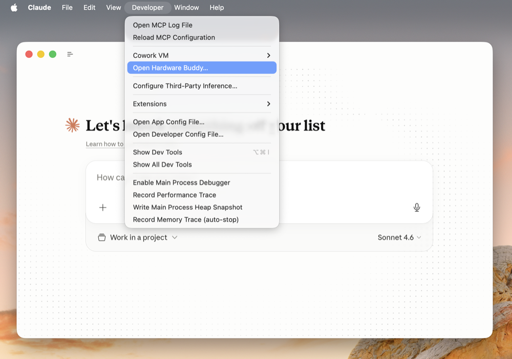
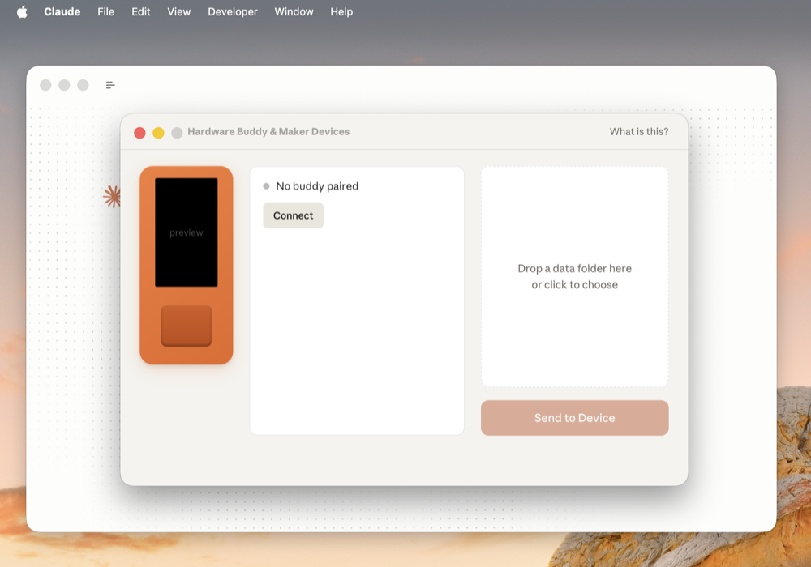

# Claude Desktop Buddy — M5Stack Cardputer ADV

**This is a fork of [anthropics/claude-desktop-buddy](https://github.com/anthropics/claude-desktop-buddy),
ported to run on the [M5Stack Cardputer ADV](https://shop.m5stack.com/products/m5stack-cardputer-adv-version-esp32-s3)
(Stamp-S3A / ESP32-S3)** — not the M5StickC Plus the upstream project
targets. If you have a Cardputer ADV, this is the tree to flash. If you
have a StickC Plus, use the upstream repo instead.

The Cardputer ADV is a genuinely different machine from the StickC Plus:
ESP32-**S3**, a landscape 240×135 screen, a 56-key keyboard instead of two
side buttons, no RTC chip, no AXP power-management IC. Porting it meant
reworking the layout, input handling, power/battery reporting, the clock
screensaver, and the attention LED — see
[Hardware differences](#hardware-differences-from-the-m5stickc-plus-original)
below for the honest list of what's better, what's degraded, and what got
dropped along the way.

---

Claude for macOS and Windows can connect Claude Cowork and Claude Code to
maker devices over BLE, so developers and makers can build hardware that
displays permission prompts, recent messages, and other interactions. As an
example, Anthropic built a desk pet that lives off permission approvals and
interaction with Claude. It sleeps when nothing's happening, wakes when
sessions start, gets visibly impatient when an approval prompt is waiting,
and lets you approve or deny right from the device. This fork brings that
same buddy to the Cardputer ADV's keyboard-and-landscape-screen form factor.

> **Building your own device?** You don't need any of the code here. See
> **[REFERENCE.md](REFERENCE.md)** for the wire protocol: Nordic UART
> Service UUIDs, JSON schemas, and the folder push transport. It's
> hardware-agnostic and unchanged from upstream.

## Hardware

The firmware targets ESP32-**S3** with the Arduino framework, via the
[`m5stack/M5Cardputer`](https://github.com/m5stack/M5Cardputer) library
(itself built on M5Unified/M5GFX). You'll need a Cardputer ADV, or a fork
that swaps the display/keyboard/power drivers for your own pin layout.

### Hardware differences from the M5StickC Plus original

| | M5StickC Plus | Cardputer ADV |
| --- | --- | --- |
| Input | 2 side buttons | 56-key keyboard (see [Controls](#controls)) |
| Screen | 135×240 portrait | 240×135 landscape, pet + HUD side by side |
| IMU (shake/nap) | MPU6886 | BMI270 — same API, thresholds not yet tuned on real hardware |
| Clock screensaver | RTC chip, survives reboot | **No RTC chip.** RAM-only clock set from the desktop's BLE time sync — resets to hidden on every reboot until re-paired |
| Status LED | discrete LED, pulses on approval | **No LED.** Periodic beep instead, only while the screen is off (the animated pet already shows it while the screen's on) |
| Battery % | AXP192 fuel gauge | ADC-only voltage estimate — no current sense, no VBUS detection, no temperature. The Device info page and BLE `status` command are shorter accordingly |
| Power off | AXP192 rail cut | `deepSleep()` — there's no PMIC to cut power in software; only the physical slide switch fully powers it down |

## Flashing

Install
[PlatformIO Core](https://docs.platformio.org/en/latest/core/installation/),
then:

```bash
pio run -t upload
```

If you're starting from a previously-flashed device, wipe it first:

```bash
pio run -t erase && pio run -t upload
```

Once running, you can also wipe everything from the device itself: **Tab →
settings → reset → factory reset → Enter twice**.

## Pairing

To pair your device with Claude, first enable developer mode (**Help →
Troubleshooting → Enable Developer Mode**). Then, open the Hardware Buddy
window in **Developer → Open Hardware Buddy…**, click **Connect**, and pick
your device from the list. macOS will prompt for Bluetooth permission on
first connect; grant it.

<p align="center">
  
  
</p>

Once paired, the bridge auto-reconnects whenever both sides are awake.

If discovery isn't finding the stick:

- Make sure it's awake (any button press)
- Check the stick's settings menu → bluetooth is on

## Controls

Interaction moved onto the keyboard entirely — the reachable G0/BOOT button
on the Stamp-S3A module isn't used for buddy UI. The registry release of
`M5Cardputer` has no Fn-layer/Esc/arrow-key support in its keyboard API, so
deny and navigation are bound directly to the physical keys that sit where
Fn-arrows would be, no Fn needed: **`` ` ``** (top-left key) for deny/back,
**`;` `.` `/`** for up/down/next-page.

|                  | Normal                 | Pet         | Info        | Approval    |
| ---------------- | ---------------------- | ----------- | ----------- | ----------- |
| **Enter**        | —                      | —           | —           | **approve** |
| **`` ` ``**      | back/close             | back/close  | back/close  | **deny**    |
| **Tab**          | menu                   | menu        | menu        | menu        |
| **Space**        | next screen            | next screen | next screen | —           |
| **`/`**          | —                      | next page   | next page   | —           |
| **`;`  `.`**     | scroll transcript      | —           | —           | —           |
| **Shake**        | dizzy                  |             |             | —           |
| **Face-down**    | nap (energy refills)   |             |             |             |

Inside menus, **`;`/`.`** navigates items and **Enter** selects.

The screen auto-powers-off after 3 minutes of no interaction (kept on while an
approval prompt is up). Any keypress wakes it.

## ASCII pets

Eighteen pets, each with seven animations (sleep, idle, busy, attention,
celebrate, dizzy, heart). Menu → "next pet" cycles them with a counter.
Choice persists to NVS.

## GIF pets

If you want a custom GIF character instead of an ASCII buddy, drag a
character pack folder onto the drop target in the Hardware Buddy window. The
app streams it over BLE and the stick switches to GIF mode live. **Settings
→ delete char** reverts to ASCII mode.

A character pack is a folder with `manifest.json` and 96px-wide GIFs:

```json
{
  "name": "bufo",
  "colors": {
    "body": "#6B8E23",
    "bg": "#000000",
    "text": "#FFFFFF",
    "textDim": "#808080",
    "ink": "#000000"
  },
  "states": {
    "sleep": "sleep.gif",
    "idle": ["idle_0.gif", "idle_1.gif", "idle_2.gif"],
    "busy": "busy.gif",
    "attention": "attention.gif",
    "celebrate": "celebrate.gif",
    "dizzy": "dizzy.gif",
    "heart": "heart.gif"
  }
}
```

State values can be a single filename or an array. Arrays rotate: each
loop-end advances to the next GIF, useful for an idle activity carousel so
the home screen doesn't loop one clip forever.

GIFs are 96px wide; the pet renders in a 120×135 left-hand column now (was
the full 135×240 portrait screen on the M5StickC Plus original), so keep
height modest too. Crop tight to the character — transparent margins waste
screen and shrink the sprite. `tools/prep_character.py` handles the resize:
feed it source GIFs at any sizes and it produces a 96px-wide set where the
character is the same scale in every state.

The whole folder must fit under 1.8MB —
`gifsicle --lossy=80 -O3 --colors 64` typically cuts 40–60%.

See `characters/bufo/` for a working example.

If you're iterating on a character and would rather skip the BLE round-trip,
`tools/flash_character.py characters/bufo` stages it into `data/` and runs
`pio run -t uploadfs` directly over USB.

## The seven states

| State       | Trigger                     | Feel                        |
| ----------- | --------------------------- | --------------------------- |
| `sleep`     | bridge not connected        | eyes closed, slow breathing |
| `idle`      | connected, nothing urgent   | blinking, looking around    |
| `busy`      | sessions actively running   | sweating, working           |
| `attention` | approval pending            | alert, **beeps if screen's off** |
| `celebrate` | level up (every 50K tokens) | confetti, bouncing          |
| `dizzy`     | you shook the stick         | spiral eyes, wobbling       |
| `heart`     | approved in under 5s        | floating hearts             |

## Project layout

```
src/
  main.cpp       — loop, state machine, UI screens
  buddy.cpp      — ASCII species dispatch + render helpers
  buddies/       — one file per species, seven anim functions each
  ble_bridge.cpp — Nordic UART service, line-buffered TX/RX
  character.cpp  — GIF decode + render
  data.h         — wire protocol, JSON parse
  xfer.h         — folder push receiver
  stats.h        — NVS-backed stats, settings, owner, species choice
characters/      — example GIF character packs
tools/           — generators and converters
```

## Availability

The BLE API is only available when the desktop apps are in developer mode
(**Help → Troubleshooting → Enable Developer Mode**). It's intended for
makers and developers and isn't an officially supported product feature.
